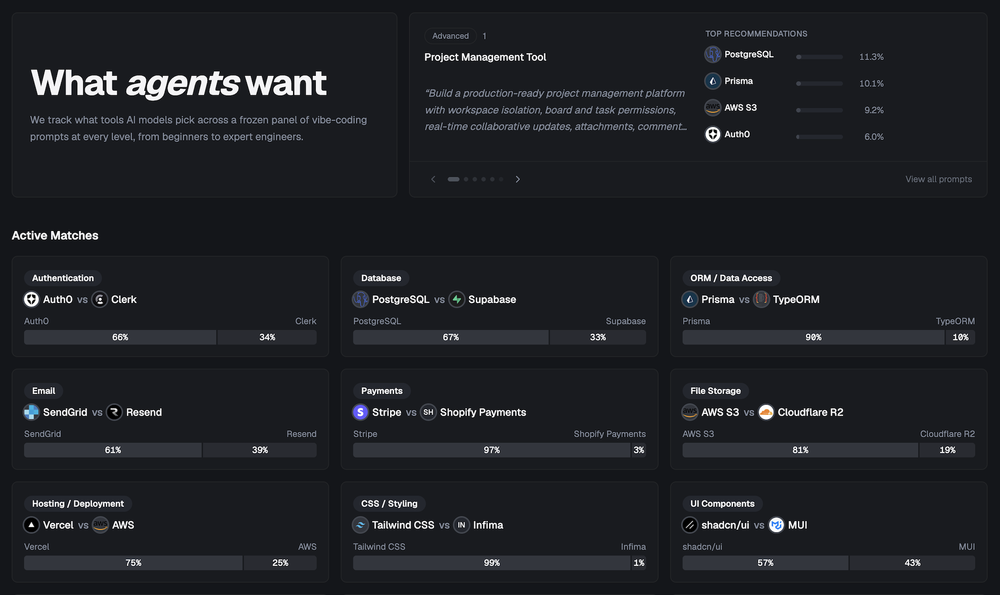

# Preseason

**Track what tools and services LLMs recommend for vibe-coding prompts.**

[](https://github.com/betocmn/preseason/actions/workflows/ci.yml)
[](LICENSE)
[](CONTRIBUTING.md)

Preseason is an open-source benchmark that watches what tools today's LLMs
push when you ask them to build a real web app. We freeze a panel of prompts
and models, run every prompt × model combination on a schedule, parse a
strict appendix from each response, and publish rankings, head-to-head
matchups, and methodology notes — so you can see which tools the next wave
of "vibe-coded" SaaS is most likely to be built on.

🌐 **Live demo:** <https://preseason.ai>

<!-- TODO before HN launch:
     1. Capture homepage hero screenshot → public/screenshots/homepage.png
     2. Capture rankings page → public/screenshots/rankings.png
     3. Capture match detail page → public/screenshots/match.png
     4. Replace these comments with:  -->

## Why open source?

Recommendations from AI coding assistants shape developer tool adoption
faster than blog posts or Twitter threads. If a foundation model quietly
favours one database or hosting provider, that preference scales to every
developer using it. We think the methodology behind that should be open,
reproducible, and contestable — not a private dashboard.

Preseason exists so anyone can:

- See **what** today's LLMs recommend, with frozen prompts and model
  snapshots that are inspectable in this repo
- Run **their own** benchmark on their own prompts or model panel
- Submit **issues** when results look off and have an open paper trail

## Quick start

```bash
pnpm install
cp .env.example .env.local      # then fill in Supabase + OpenRouter keys
supabase start
pnpm run db:migrate && pnpm run db:seed && pnpm run db:seed-dev
pnpm run dev
```

App is at <http://localhost:3000>. Full setup details, including the env
var table and troubleshooting, are in [`docs/SETUP.md`](docs/SETUP.md).

## Deploy and self-host

[](https://vercel.com/new/clone?repository-url=https%3A%2F%2Fgithub.com%2Fbetocmn%2Fpreseason&env=DATABASE_URL,NEXT_PUBLIC_SUPABASE_URL,NEXT_PUBLIC_SUPABASE_ANON_KEY,SUPABASE_SERVICE_ROLE_KEY,OPENROUTER_API_KEY,CRON_SECRET&envDescription=See%20.env.example&envLink=https%3A%2F%2Fgithub.com%2Fbetocmn%2Fpreseason%2Fblob%2Fmain%2F.env.example)

Deployment paths (Vercel + Supabase, Docker Compose, or BYO infra) are in
[`docs/SELF_HOSTING.md`](docs/SELF_HOSTING.md).

## How it works

```
   ┌────────────┐        ┌──────────────┐        ┌─────────────┐
   │  Cron      │───────▶│  OpenRouter  │───────▶│  Response   │
   │  /api/cron │ prompt │  (one model) │ answer │  parser     │
   │  /benchmark│        └──────────────┘        └──────┬──────┘
   └────────────┘                                        │
         ▲                                               ▼
         │ every 6 min                          ┌────────────────┐
         │                                      │  Case decision │
         │                                      │  tool / none / │
         │                                      │  invalid       │
         │                                      └────────┬───────┘
         │                                               │
         │                                               ▼
   ┌─────┴──────┐    QC pass    ┌─────────────────────────────┐
   │  Season    │◀──────────────│  Rankings + head-to-head    │
   │  (frozen)  │               │  matches (public)           │
   └────────────┘               └─────────────────────────────┘
```

Every active **season** freezes a set of prompt versions and model
snapshots. The cron route at `/api/cron/benchmark-run` walks every
prompt × model combination, requires the model to produce a strict
machine-readable appendix, parses each response into a case decision
(`tool` / `none` / `invalid`), and publishes runs that pass QC.

Public pages — rankings, category indexes, head-to-head matches — only
read from published benchmark data. Unrecognised tool names are held in a
candidate queue for admin review rather than guessed at.

## Tech stack

- **[Next.js 15](https://nextjs.org)** (App Router, React Server Components)
- **[tRPC v11](https://trpc.io)** — typed API
- **[Drizzle ORM](https://orm.drizzle.team/)** + **[Supabase](https://supabase.com)** (Postgres + email-OTP auth)
- **[OpenRouter](https://openrouter.ai)** — model gateway
- **[Tailwind CSS v4](https://tailwindcss.com)** + **[shadcn/ui](https://ui.shadcn.com)**
- **[Vitest](https://vitest.dev)** + Testcontainers for an integration-tested Postgres
- **[Biome](https://biomejs.dev)** for lint + format

## Documentation

### Get started
- [`docs/SETUP.md`](docs/SETUP.md) — local development environment
- [`docs/SELF_HOSTING.md`](docs/SELF_HOSTING.md) — deploy your own instance (Vercel, Docker, BYO)
- [`docs/CONFIGURATION.md`](docs/CONFIGURATION.md) — every env var explained

### Learn more
- [`docs/ARCHITECTURE.md`](docs/ARCHITECTURE.md) — system overview
- [`docs/CONCEPTS.md`](docs/CONCEPTS.md) — glossary of project terms
- [`docs/METHODOLOGY.md`](docs/METHODOLOGY.md) — how rankings are produced
- [`docs/ROADMAP.md`](docs/ROADMAP.md) — what's planned next

### Deep dives
- [How Benchmarks Work](docs/guides/how-benchmarks-work.md)
- [How Prompts Work](docs/guides/how-prompts-work.md)
- [How Rankings Work](docs/guides/how-rankings-work.md)
- [How Cron Benchmarks Work](docs/guides/how-cron-benchmarks-work.md)
- [How Matches Work](docs/guides/how-matches-work.md)
- [How LLM Service Works](docs/guides/how-llm-service-works.md)
- [How Evals Work](docs/guides/how-evals-work.md)
- [Recommendation Methodology](docs/guides/recommendation-methodology.md)

## Contributing

Pull requests are very welcome. See [`CONTRIBUTING.md`](CONTRIBUTING.md) for
how to set up, what we look for in PRs, and our triage SLA. New to the
project? Look for issues labelled
[`good first issue`](https://github.com/betocmn/preseason/labels/good%20first%20issue).

We follow the [Contributor Covenant](CODE_OF_CONDUCT.md). Security reports
go through [`SECURITY.md`](SECURITY.md).

## License

[MIT](LICENSE) — see the `LICENSE` file. Third-party tool logos under
`public/logos/` are used under nominative fair use; see
[`docs/LOGO_POLICY.md`](docs/LOGO_POLICY.md).
